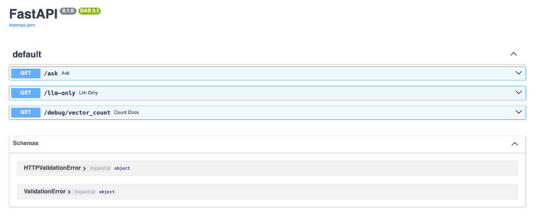

# Understanding retrieval-augmented generation 
Usecase: ability so solve math problems 

## 1. Context and objectives
The purpose of Retrieval-Augmented Generation (RAG) is to enrich the answers of a Large Language Model (LLM) by giving it access to a personalized knowledge base, in addition to its native training data. This project aims to build a RAG system capable of solving math problems. Indeed, LLMs are known to struggle with math and often lack robust mathematical skills and deep reasoning abilities. [1], [2]

We describe how to set up a RAG system in a containerized environment to ensure portability and ease of deployment. The, we evaluate the effect of providing the LLM access to a question-and-answer math database to improve its reasoning capabilities. 

[1] Who's the Best Detective? Large Language Models vs. Traditional Machine Learning in Detecting Incoherent Fourth Grade Math Answers, https://journals.sagepub.com/doi/10.1177/07356331231191174
[2] Stuck in the Quicksand of Numeracy, Far from AGI Summit: Evaluating LLMs’ Mathematical Competency through Ontology-guided Perturbations, https://arxiv.org/html/2401.09395v1
 

## 2. Quick setup

Repo structure:  

```bash

RAG_math_problem_solver/    # Root project directory
│
├── backend                 # Backend logic (RAG system)
│    └──app.py              # FastAPI app with endpoints (e.g. /ask, /llm-only)
│    └──index_docs.py       # Script to load and embed math documents into PGVector
│    └──requirements.txt    # Python dependencies for backend
│    └──Dockerfile          # Dockerfile to contenerize the FastAPI backend
├── streamlit               # Streamlit-based frontend
│    └──streamlit_app.py    # Streamlit web interface for interacting with the RAG system
│    └──utils.py            # Utility functions for the Streamlit app
│    └──requirements.txt    # Python dependencies for Streamlit
│    └──Dockerfile          # Dockerfile to contenerize the Streamlit frontend
├── .env                    # Environment variables (e.g., DATABASE_URL, OLLAMA_URL)
├── docker-compose.yml      # Compose file to orchestrate both backend and frontend services
├── Makefile                # Useful CLI commands (e.g., `make up`, `make index`, etc.)
└── README.md               # Project overview, setup instructions, usage

```

Before running the docker-compose.yml, some actions are required to be able to access the desired models: 

-	Install Ollama: it was done using Homebrew (macOS environment), installation information is available on the Ollama website (https://ollama.com/download)

```bash
brew install ollama
````

-	Preload the required models:
```bash
ollama pull llama3 # or ollama pull gemma:2b or other model
ollama pull nomic-embed-text
````

-	Start Docker Desktop

The first time, the images have to be built before starting all containers and mounting persistent volumes: 

```bash
docker-compose up –build
````

The indexing will start (this step takes some time) and then the services are exposed and accessible:
-	Streamlit app: http://localhost:8501/
-	FastAPI backend: http://localhost:8000/docs
-	Ollama server: http://localhost:11434
-	PostgreSQL: localhost:5432

The Makefile allows for easier interaction afterwards: 
```bash
make down / make up # to stop and restart containers
make index # to do the indexation only
make backend # to start the backend container
```

We provide here some additional actions that can be done to check that everything is running correctly. 

```bash
curl http://localhost:11434/api/tags
```
This allows to retrieve a list of all models currently available in the local Ollama installation (names, dates of modification, metadata,…)

-	to connect to the database: 
```bash
docker ps #to list the containers and get the pgvector container id
docker exec -it <id> bash
psql -U postgres -d vectordb
\dt #to list the tables
```
 

langchain_pg_collection stores metadata about the named collections whereas langchain_pg_embedding stores all the actual embedded documents. 

Note: it might be needed to add the pgvector extension manually in some cases:
```bash
psql -U postgres -d vectordb
CREATE EXTENSION IF NOT EXISTS vector;
\q
```

We added a FastAPI endpoint to easily check the number of indexed questions and answers in the database, and monitor the indexing step which is quite long: 
```bash
curl -X 'GET' \
  'http://localhost:8000/debug/vector_count' 
# Example of response: {"count":200}
```

Requests to the API can be done using the interface http://localhost:8000/docs or directly using cli. We added an endpoint for a RAG request, but also one for the LLM only to compare the results. 
```bash
curl -X 'GET' 'http://localhost:8000/ask?q=<your_request>'
curl -X 'GET' 'http://localhost:8000/llm-only?q=<your_request>'
```

## 3. Results and illustration

* Streamlit application: 
<div style="display: flex; justify-content: center;">
  
</div>


* FastAPI backend interface:
<div style="display: flex; justify-content: center;">
  
</div>

* Example of answers of the different models based on an input provided in the dataset:
<div style="display: flex; justify-content: center;">
  
</div>